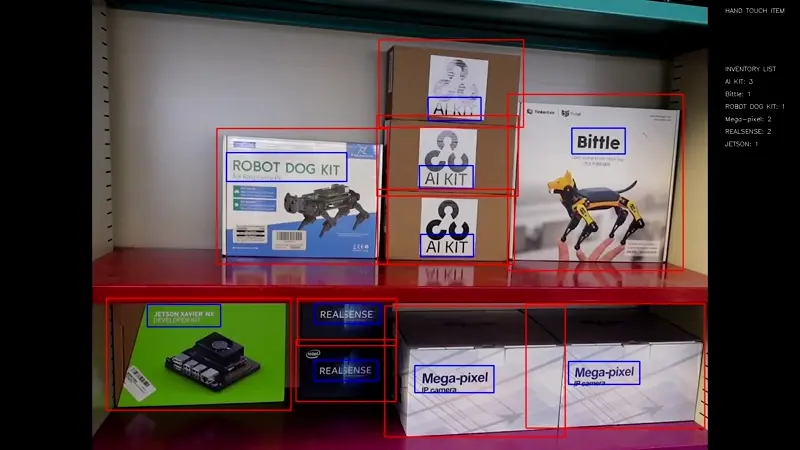

<p align="center">

</p>


# Inventory Management using Video Analytics

Building a complete inventory management solution generally involves connecting to an ERP or inventory management system.  However, a good first step in building such a system is to train visual detectors to identify objects of interest, and annotate a video so you can see how well it's working.  This demo will walk you through the process of training a detector and annotating a video.

<p align="center">

</p>

<p align="center">
  <a href="https://vimeo.com/1036091427" target="_blank">
    Click here for full resolution
  </a>
</p>

## Installation

The code supports installing the dependencies using `uv`.

```bash
# Clone this repo
git clone git@github.com:groundlight/inventory-management.git
```

Then install the dependencies using `uv`

```bash
cd inventory-management
uv venv
uv sync --no-build-isolation
```

## Generating the data

### Videos

Download them, and put them into `data/videos` and DVC.

### Frames

First, consider how much motion detection you want, and preview.  Something like 0.1% will be very sensitive, and catch any tiny motion.  Something like 2% will catch fewer more representative frames.

```bash
./video-to-frames.py data/videos/videoname.mp4 \
    --pct-threshold 0.1 \
    --preview
```

Run the script to generate the frames:

```bash
./video-to-frames.py data/videos/videoname.mp4 \
    --pct-threshold 0.1 \
    --save-to data/frames/videoname-0.1
```

The generated frames will be saved to `data/frames/videoname-0.1`

